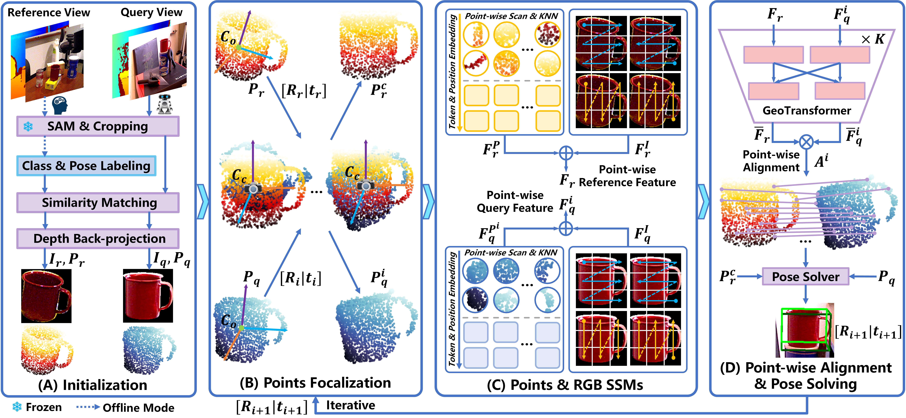

# Novel Object 6D Pose Estimation with a Single Reference View

This is the PyTorch implementation of paper **[SinRef-6D]()** developed by <a href="https://cnjliu.github.io/">J. Liu</a>, <a href="http://robotics.hnu.edu.cn/info/1071/1265.htm">W. Sun</a>, <a href="https://github.com/CNJianLiu/SinRef-6D">K. Zeng</a>, <a href="https://github.com/CNJianLiu/SinRef-6D">J. Zheng</a>, <a href="https://github.com/CNJianLiu/SinRef-6D">H. Yang</a>, <a href="https://scholar.google.com.hk/citations?hl=zh-CN&user=SReb2csAAAAJ">L. Wang</a>, <a href="https://sites.google.com/view/rahmaniatlu">H. Rahmani</a>, and <a href="https://ajmalsaeed.net/">A. Mian</a>. SinRef-6D is a single reference view-based CAD model-free novel object 6D pose estimation method, which is **simple yet effective** and has **strong scalability for practical applications**.



## Real-World Demo
SinRef-6D deployment in real-world robotic manipulation scenarios. Notably, the reference view is **not carefully selected**. We **randomly** select a normal view (free of occlusion, with minimal self-occlusion, and resembling a typical robotics manipulation view) using an Intel RealSense L515 RGB-D camera as the reference view.


To the best of our knowledge, we are the first to present a method for novel object 6D absolute pose estimation using only a single reference view in real-world robotic manipulation scenarios. This approach simultaneously eliminates the need for object *CAD models*, *dense reference views*, and *model retraining*, offering enhanced efficiency and scalability while demonstrating **strong generalization to potential real-world robotic applications**.

## Citation
If you find our work useful, please consider citing:
```latex
@article{SinRef-6D,
  author={Liu, Jian and Sun, Wei and Zeng, Kai and Zheng, Jin and Yang, Hui and Wang, Lin and Rahmani, Hossein and Mian, Ajmal},
  title={Novel Object 6D Pose Estimation with a Single Reference View},
  journal={},
  year={2025}
}
```

## Licence

This project is licensed under the terms of the MIT license.
