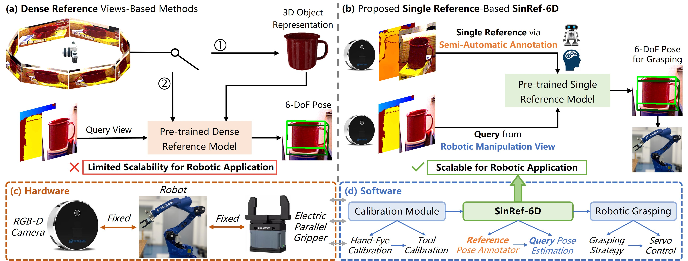

# Scalable Unseen Objects 6-DoF Absolute Pose Estimation with Robotic Integration

This is the PyTorch implementation of paper **[SinRef-6D](https://paperreview99.github.io/SinRef-6DoF-Robotic)** published in <b>*IEEE TRO*</b> by <a href="https://cnjliu.github.io/">J. Liu</a>, <a href="http://robotics.hnu.edu.cn/info/1071/1265.htm">W. Sun</a>, <a href="https://github.com/CNJianLiu/SinRef-6D">K. Zeng</a>, <a href="https://github.com/CNJianLiu/SinRef-6D">J. Zheng</a>, <a href="https://github.com/CNJianLiu/SinRef-6D">H. Yang</a>, <a href="https://sites.google.com/view/rahmaniatlu">H. Rahmani</a>, <a href="https://ajmalsaeed.net/">A. Mian</a>, and <a href="https://github.com/CNJianLiu/SinRef-6D">L. Wang</a>. SinRef-6D is a single reference view-based CAD model-free novel object 6D pose estimation method, which is **simple yet effective** and has **strong scalability for practical applications**.

Given a **single RGB-D reference view** of an unseen object in a **default robot manipulation viewpoint**, we aim to predict its 6-DoF absolute pose from **any query view**.



## Real-World Demo
SinRef-6D deployment in real-world robotic manipulation scenarios. Notably, the reference view is **not carefully selected**. We select a default robot manipulation viewpoint (free of occlusion and with minimal self-occlusion) using an Intel RealSense L515 RGB-D camera as the reference view.


To the best of our knowledge, we are the first to present a method for novel object 6D absolute pose estimation using only a single reference view in real-world robotic manipulation scenarios. This approach simultaneously eliminates the need for object *CAD models*, *dense reference views*, and *model retraining*, offering enhanced efficiency and scalability while demonstrating **strong generalization to potential real-world robotic applications**.

More robotic demos can be seen at our **[Project Page](https://paperreview99.github.io/SinRef-6DoF-Robotic)**.

## SinRef-6D Repository

This repository contains:

- Training code for the pose estimation model
- BOP evaluation scripts
- Custom-object inference scripts
- CUDA/C++ extensions used by the model

### 1. Repository Structure

```text
SinRef-6D
├── Pose_Estimation_Model/
│   ├── config/
│   ├── model/
│   ├── provider/
│   ├── utils/
│   ├── train.py
│   ├── test_bop.py
│   └── run_inference_custom.py
├── Data/
├── kernels/
├── dwconv/
└── environment.yaml
```

Main folders:

- `Pose_Estimation_Model/`: core model, datasets, training, evaluation, and inference
- `Data/`: expected dataset layout and example inputs
- `kernels/`, `dwconv/`: low-level CUDA extensions used by the VMamba and point processing code

The model pipeline is:

1. Crop an observed object instance from RGB-D input.
2. Convert depth to an observed point cloud.
3. Load rendered templates for the target object.
4. Extract RGB-aligned features with VMamba and point features with PointMamba.
5. Match observed points to template points.
6. Recover the final pose with correspondence-based rigid alignment.

The main model entry is `Pose_Estimation_Model/model/pose_estimation_model.py`.

### 2. Environment Setup

The recommended environment is defined in `environment.yaml`.

This setup is intended for:

- Linux
- NVIDIA GPU
- CUDA 11.8
- Python 3.10
- PyTorch 2.0.0

#### Create the conda environment

```bash
conda env create -f environment.yaml
conda activate sinref6d
```

#### Install CUDA extensions

After activating the environment, build the local extensions:

```bash
export CUDA_HOME=/usr/local/cuda-11.8
cd Pose_Estimation_Model/model/pointnet2
python setup.py install
cd ../../../
```

Optional extensions:

- `kernels/selective_scan/` is bundled in the repo and provides low-level kernels used by the VMamba stack
- `dwconv/` is also bundled and can be installed separately if you use that branch of the code

If `knn_cuda` is unavailable on your machine, the code now falls back to a pure PyTorch KNN implementation. It is slower, but useful for first-time setup and debugging.

If `causal-conv1d` needs to be built locally, you can also install it from the bundled source tree:

```bash
cd Pose_Estimation_Model/model/causal-conv1d
python setup.py install
cd ../../../
```

### 3. Data Preparation

The expected directory layout is:

```text
Data
├── MegaPose-Training-Data
│   ├── MegaPose-GSO
│   └── MegaPose-ShapeNetCore
├── BOP
│   ├── ycbv
│   ├── lmo
│   ├── icbin
│   ├── itodd
│   ├── hb
│   ├── tudl
│   └── tless
└── BOP-Templates
    ├── ycbv
    ├── lmo
    ├── icbin
    ├── itodd
    ├── hb
    ├── tudl
    └── tless
```

By default, the config uses relative paths:

- `Data/MegaPose-Training-Data`
- `Data/BOP`
- `Data/BOP-Templates`

If your datasets are stored outside the repo, the code will also try to resolve the same `Data/...` structure from a shared parent directory.

### 4. Template Files

Expected template roots:

- training templates:
  - `Data/MegaPose-Training-Data/MegaPose-GSO/templates`
  - `Data/MegaPose-Training-Data/MegaPose-ShapeNetCore/templates`
- BOP test templates:
  - `Data/BOP-Templates/<dataset>`
- custom inference templates:
  - `/path/to/custom_case/templates`

The training and BOP loaders expect pre-rendered RGB, mask, depth or XYZ files together with pose metadata in the layout already used by this repository.

### 5. Training

Use the base config:

```bash
python Pose_Estimation_Model/train.py \
  --config Pose_Estimation_Model/config/base.yaml \
  --model pose_estimation_model \
  --gpus 0
```

Common arguments:

- `--gpus`: GPU ids, for example `0` or `0,1`
- `--exp_id`: experiment id used in the log directory name
- `--checkpoint_iter`: resume from a saved iteration

Training outputs are written under:

```text
log/<model>_<config>_id<exp_id>/
```

### 6. BOP Evaluation

#### Example:

```bash
python Pose_Estimation_Model/test_bop.py \
  --config Pose_Estimation_Model/config/base.yaml \
  --dataset ycbv \
  --gpus 0
```

The script expects detection results in a directory containing files such as:

- `result_ycbv.json`
- `result_lmo.json`
- `result_tless.json`

You can override the detection directory explicitly:

```bash
python Pose_Estimation_Model/test_bop.py \
  --config Pose_Estimation_Model/config/base.yaml \
  --dataset ycbv \
  --gpus 0 \
  --detection_dir /path/to/detection_jsons
```

Generated BOP csv files are saved under `log/...`.

#### Fastest YCBV Reproduction

If you only want to verify that the repository works end-to-end on YCB-V as quickly as possible, use this order:

1. Create and activate the environment:

```bash
conda env create -f environment.yaml
conda activate sinref6d
```

If `mamba-ssm` or `causal-conv1d` does not install cleanly during environment creation, install them manually before continuing.

2. Build the PointNet++ extension:

```bash
export CUDA_HOME=/usr/local/cuda-11.8
cd Pose_Estimation_Model/model/pointnet2
python setup.py install
cd ../../../
```

3. Prepare these three directories:

```text
Data/BOP/ycbv
Data/BOP-Templates/ycbv
Data/bop23_default_detections_for_task4/bop23_default_detections_for_task4/cnos-fastsam/result_ycbv.json
```

4. Run YCB-V evaluation:

```bash
python Pose_Estimation_Model/test_bop.py \
  --config Pose_Estimation_Model/config/base.yaml \
  --dataset ycbv \
  --gpus 0 \
  --iter 2400000
```

5. Check the output csv:

```text
log/pose_estimation_model_base_id0/ycbv_eval_iter2400000/result_ycbv-test.csv
```

If your detection jsons are stored somewhere else, pass:

```bash
--detection_dir /path/to/detection_jsons
```

### 7. Custom Object Inference

Prepare a custom template directory first:

```text
/path/to/custom_case/templates
```

Then run inference:

```bash
python Pose_Estimation_Model/run_inference_custom.py \
  --output_dir /path/to/custom_case \
  --rgb_path /path/to/rgb.png \
  --depth_path /path/to/depth.png \
  --cam_path /path/to/camera.json \
  --seg_path /path/to/detections.json \
  --gpus 0
```

Optional:

```bash
--cad_path /path/to/model.ply
```

If `--cad_path` is omitted, the script falls back to template point clouds for radius estimation and visualization.

Outputs will be written to:

- `/path/to/custom_case/sam6d_results/detection_pem.json`
- `/path/to/custom_case/sam6d_results/vis_pem.png`

### 8. Evaluation Utilities

Additional scripts are included for metric computation:

- `Pose_Estimation_Model/eval_lm_ADD-0.1d.py`
- `Pose_Estimation_Model/eval_ycbv_ADD(S).py`
- `Pose_Estimation_Model/eval_single_object_pose.py`

These are command-line tools now. Use `--help` on each script for arguments.

### 9. Reproducibility Checklist and Common Issues

For a fast first reproduction, follow this exact order:

1. Clone the repository.
2. Create the conda environment from `environment.yaml`.
3. Build the `pointnet2` extension.
4. Prepare the `Data/` directory structure.
5. Download or prepare template files.
6. Verify that `Pose_Estimation_Model/config/base.yaml` points to the correct data locations.
7. Run `test_bop.py` on one dataset first, such as `ycbv`.
8. Run training only after evaluation and data loading work correctly.

#### Empty template list or `torch.stack` on an empty list

This usually means the object model directory or pre-rendered template directory was not found. Check:

- `Data/BOP/<dataset>/models`
- `Data/BOP-Templates/<dataset>`

#### `knn_cuda` import failure

The code now has a PyTorch fallback. It can run without `knn_cuda`, but may be slower.

#### `imgaug` or `h5py` binary compatibility errors

These usually come from incompatible NumPy versions. The provided environment pins NumPy to the 1.24 series to avoid that issue.

#### CUDA extension build issues

Make sure:

- your PyTorch CUDA version matches your installed CUDA toolkit
- `nvcc` is available
- your environment is activated before building extensions

## Citation
If you find our work helpful, please consider citing:
```latex
@article{2026SinRef-6D,
  author={Liu, Jian and Sun, Wei and Zeng, Kai and Zheng, Jin and Yang, Hui and Rahmani, Hossein and Mian, Ajmal and Wang, Lin},
  title={Scalable Unseen Object 6-DoF Absolute Pose Estimation with Robotic Integration},
  journal={IEEE Transactions on Robotics},
  year={2026}
}
```

## Acknowledgements
Our implementation leverages the code from the repository below. We thank all for releasing their code.
- [MegaPose](https://github.com/megapose6d/megapose6d)
- [GigaPose](https://github.com/nv-nguyen/gigaPose)
- [GeoTransformer](https://github.com/qinzheng93/GeoTransformer)
- [VMamba](https://github.com/MzeroMiko/VMamba?tab=readme-ov-file)
- [SAM6D](https://github.com/JiehongLin/SAM-6D)
- [PointMamba](https://github.com/LMD0311/PointMamba/tree/main)

## Licence

This project is licensed under the terms of the MIT license.
